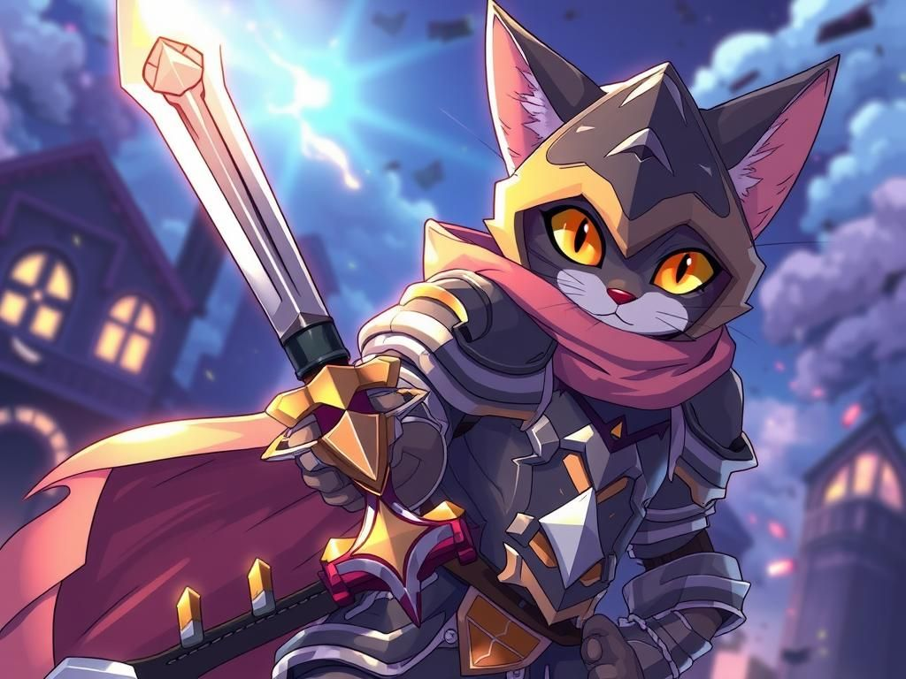
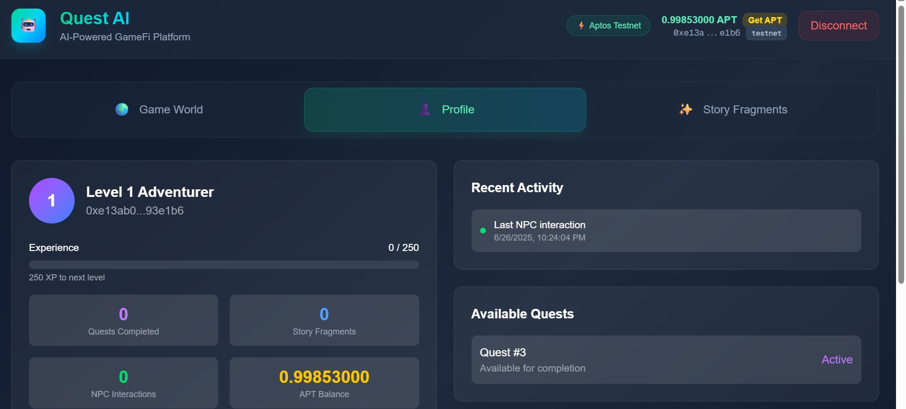
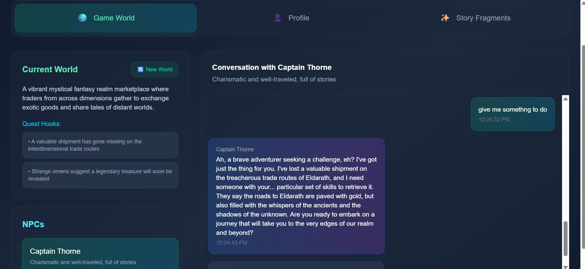
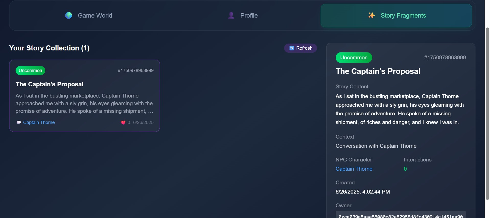

# Quest AI



An AI-powered GameFi platform built on Aptos blockchain where NPCs create dynamic storylines, generate quests in real-time, and evolve based on player interactions. Players can mint unique story fragments as NFTs and experience procedural game worlds powered by advanced language models.

## 🎥 Demo Video

[](https://www.youtube.com/watch?v=P54zcg19UxE)

*Click the image above to watch our comprehensive demo showcasing AI-powered NPCs, dynamic quest generation, and blockchain integration.*

## 📸 Screenshots

<div align="center">
  
### Gamer Profile


### NPC Interactions & Custom Story


### Player Progression and Artifacts on Chain


</div>

---

## 🌟 Features

- **AI-Powered NPCs**: NPCs powered by Together AI and Groq (Llama 3.3 70B & Llama 4 Maverick) create dynamic dialogue and evolving personalities
- **Story Fragment NFTs**: Mint unique story moments as NFTs during memorable NPC interactions using Aptos token objects
- **Dynamic Quest Generation**: AI generates quests and rewards in real-time based on gameplay context and player level
- **Procedural World Generation**: AI creates immersive game worlds with unique NPCs and storylines for each session
- **Player Progression**: Level up, gain experience, and track achievements on-chain with persistent profiles
- **Demo-Friendly**: Programmatic wallet creation with localStorage persistence for seamless testing experience

## 🚀 Quick Start

### Prerequisites

- Node.js 18+ and pnpm
- Together AI API key (get from [together.ai](https://together.ai)) for Llama 3.3 70B
- Groq API key (get from [groq.com](https://groq.com)) for Llama 4 Maverick

### Setup

1. **Clone and install dependencies:**
   ```bash
   git clone <repository>
   cd aptos-consumer
   pnpm install
   ```

2. **Environment Configuration:**
   ```bash
   cp .env.example .env.local
   ```

   Fill in your API keys in `.env.local`:
   ```
   AI_PROVIDER=together  # or 'groq'
   TOGETHER_API_KEY=your_together_api_key_here
   GROQ_API_KEY=your_groq_api_key_here
   NEXT_PUBLIC_MODULE_ADDRESS=0x4ec2db86ea4e41e2763366eb0a577e3a3c12aa84779905d59759ce584e8cc37c
   NEXT_PUBLIC_APTOS_NETWORK=testnet
   ```

3. **Smart Contracts (Already Deployed):**
   The Move contracts are already deployed on Aptos testnet:
   ```
   Contract Address: 0x4ec2db86ea4e41e2763366eb0a577e3a3c12aa84779905d59759ce584e8cc37c
   Network: Aptos Testnet
   ```
   
   **🔍 View Live Contract:**
   - [Contract on Aptos Explorer](https://explorer.aptoslabs.com/account/0x4ec2db86ea4e41e2763366eb0a577e3a3c12aa84779905d59759ce584e8cc37c?network=testnet)
   - [Recent Transactions](https://explorer.aptoslabs.com/account/0x4ec2db86ea4e41e2763366eb0a577e3a3c12aa84779905d59759ce584e8cc37c/transactions?network=testnet)
   - [Deployed Modules](https://explorer.aptoslabs.com/account/0x4ec2db86ea4e41e2763366eb0a577e3a3c12aa84779905d59759ce584e8cc37c/modules?network=testnet)

   *Optional - Deploy your own contract:*
   ```bash
   cd contracts
   aptos init --network testnet
   aptos move publish --named-addresses npc_ecosystem=<your_address>
   ```

4. **Run the Development Server:**
   ```bash
   pnpm dev
   ```

   Open [http://localhost:3000](http://localhost:3000) in your browser.

## 🎮 How to Demo

The app is designed for easy demonstration with a seamless user experience:

1. **Landing Page**: Showcases the concept with modern glass morphism UI
2. **One-Click Wallet**: Creates a demo wallet that persists across sessions
3. **Testnet Funding**: Get APT from faucet with pre-filled addresses  
4. **Immediate Gameplay**: Start interacting with NPCs right away
5. **Visual Feedback**: All actions show immediate results with smooth animations

### Demo Flow:
1. Visit the homepage and explore the feature showcase
2. Click "Connect Wallet" (creates persistent demo wallet)
3. Fund wallet using testnet faucet (link provided with pre-filled address)
4. Click "Initialize Profile" in the Profile tab to set up on-chain data
5. Navigate to "Game World" tab and generate a procedural world
6. Select an NPC and start an intelligent conversation
7. Watch as AI generates story fragments and quests in real-time
8. Check "Profile" and "Story Fragments" tabs to see blockchain-verified progress
9. Complete quests and level up your character

## 🏗️ Architecture

### Frontend (Next.js)
- **Components**: Modular React components with Tailwind CSS
- **Wallet Integration**: Demo-friendly wallet provider for Aptos
- **AI Integration**: Direct API calls to Together AI/Groq
- **State Management**: Zustand for global state

### Smart Contracts (Move)
- **npc_ecosystem.move**: Unified contract handling story fragments, player profiles, and quest system
- **GameRegistry**: Global state management for tracking all game entities
- **Event Emission**: On-chain tracking of all player actions and achievements

### AI Services  
- **Together AI**: Primary LLM provider (Llama 3.3 70B Instruct Turbo Free)
- **Groq**: Alternative provider (Llama 4 Maverick 17B 128k Instruct)
- **Dual Provider Support**: Seamless fallback between AI providers
- **Context-Aware Prompting**: NPCs remember conversation history and player context

## 🔧 Technical Details

### Smart Contract Functions

**Core Functions:**
- `initialize_game_registry()`: One-time setup for global game state
- `initialize_player_profile()`: Create player account with progression tracking
- `mint_story_fragment()`: Create unique story NFTs from AI interactions
- `create_quest()`: Generate AI-powered quests with dynamic rewards
- `complete_quest()`: Claim rewards, gain XP, and level up
- `interact_with_fragment()`: Social interactions with story NFTs

**View Functions:**
- `get_player_profile()`: Retrieve player stats, level, and achievements  
- `get_fragment_details()`: View story NFT metadata and interaction count
- `get_total_quests()`: Check available quest count

### AI Integration

The AI service supports multiple providers and generates:
- Dynamic NPC dialogue based on personality and context
- Procedural quest generation with rewards
- Story fragment creation for memorable moments
- World generation with themed NPCs

## 📦 Deployment

### Vercel Deployment

1. **Push to GitHub**
2. **Connect to Vercel**
3. **Add Environment Variables** in Vercel dashboard
4. **Deploy**

The app will work immediately with demo wallets on Aptos testnet.

### Contract Deployment

For production, deploy contracts to Aptos mainnet:

```bash
cd contracts
aptos init --network mainnet
aptos move publish --named-addresses npc_ecosystem=<your_mainnet_address>
```

Update `NEXT_PUBLIC_MODULE_ADDRESS` in environment variables.

## 🎯 Key Highlights

**What Makes This Special:**

1. **Innovation**: First truly intelligent NPC ecosystem with AI-generated content on blockchain
2. **Technical Excellence**: Clean Move contracts + modern React frontend with TypeScript
3. **Demo Ready**: Works immediately without complex setup or wallet installation
4. **User Experience**: Beautiful glass morphism UI with smooth animations
5. **Aptos Integration**: Meaningful use of Aptos features (token objects, view functions, events)
6. **AI Integration**: Dual LLM providers with context-aware dialogue generation
7. **Scalability**: Modular architecture ready for production deployment

**Aptos-Specific Features:**
- **Move Smart Contracts**: Unified `npc_ecosystem` module with 300+ lines of Move code
- **Token Objects**: Story fragment NFTs using latest Aptos token standard
- **View Functions**: Efficient on-chain data queries (`get_player_profile`, `get_fragment_details`)
- **Event Emission**: Comprehensive tracking (`StoryFragmentMinted`, `QuestCompleted`, `PlayerLevelUp`)
- **Resource Management**: Structured data with `PlayerProfile`, `StoryFragment`, `Quest`, `GameRegistry`
- **Testnet Integration**: Full deployment on Aptos testnet with faucet support

**🔗 Live Contract Verification:**
All game actions are verifiable on Aptos blockchain:
- [View Contract Code](https://explorer.aptoslabs.com/account/0x4ec2db86ea4e41e2763366eb0a577e3a3c12aa84779905d59759ce584e8cc37c/modules/code/npc_ecosystem?network=testnet)
- [Monitor Transactions](https://explorer.aptoslabs.com/account/0x4ec2db86ea4e41e2763366eb0a577e3a3c12aa84779905d59759ce584e8cc37c/transactions?network=testnet)
- [Track Events](https://explorer.aptoslabs.com/account/0x4ec2db86ea4e41e2763366eb0a577e3a3c12aa84779905d59759ce584e8cc37c/events?network=testnet)

## 🛠️ Development

### Project Structure
```
├── app/                    # Next.js app router
├── components/            # React components
├── contracts/             # Move smart contracts
├── lib/                   # Utility libraries
└── public/               # Static assets
```

### Available Scripts
- `pnpm dev`: Start development server
- `pnpm build`: Build for production
- `pnpm start`: Start production server
- `pnpm lint`: Run ESLint

## 📝 License

MIT License - see LICENSE file for details.

---

**⛓️ Smart Contract:** [View on Aptos Testnet Explorer](https://explorer.aptoslabs.com/account/0x4ec2db86ea4e41e2763366eb0a577e3a3c12aa84779905d59759ce584e8cc37c?network=testnet)  
**📊 Live Transactions:** [Monitor Activity](https://explorer.aptoslabs.com/account/0x4ec2db86ea4e41e2763366eb0a577e3a3c12aa84779905d59759ce584e8cc37c/transactions?network=testnet)

**Quest AI** - Built with ❤️ using Next.js 15, Move smart contracts, Together AI, and Groq on Aptos blockchain.